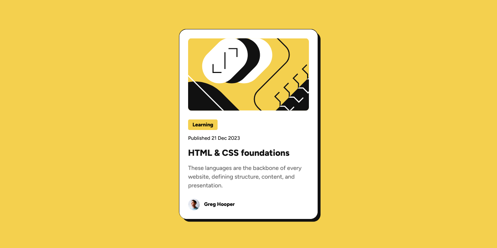

# Frontend Mentor - Blog preview card solution

This is a solution to the [Blog preview card challenge on Frontend Mentor](https://www.frontendmentor.io/challenges/blog-preview-card-ckPaj01IcS). Frontend Mentor challenges help you improve your coding skills by building realistic projects.

## Table of contents

- [Overview](#overview)
  - [Screenshot](#screenshot)
  - [Links](#links)
- [My process](#my-process)
  - [Built with](#built-with)
  - [What I learned](#what-i-learned)
- [Author](#author)

## Overview

### Screenshot

### Links

- :zap: [The project code can be found here](https://github.com/jsklcodes/blog-preview-card)
- :rocket: [Check out the project demo here](https://jsklcodes.github.io/blog-preview-card/)

## My process

### Built with

- Semantic HTML5 markup
- CSS custom properties
- BEM methodology
- Flexbox
- CSS Grid

### What I learned

I created this project to review the fundamentals of HTML and CSS (especially layout structuring). I focused on practicing code organization and maintaining a clean versioning process with well-structured commits.

## Author

- Frontend Mentor - [@jsklcodes](https://www.frontendmentor.io/profile/jsklcodes)
